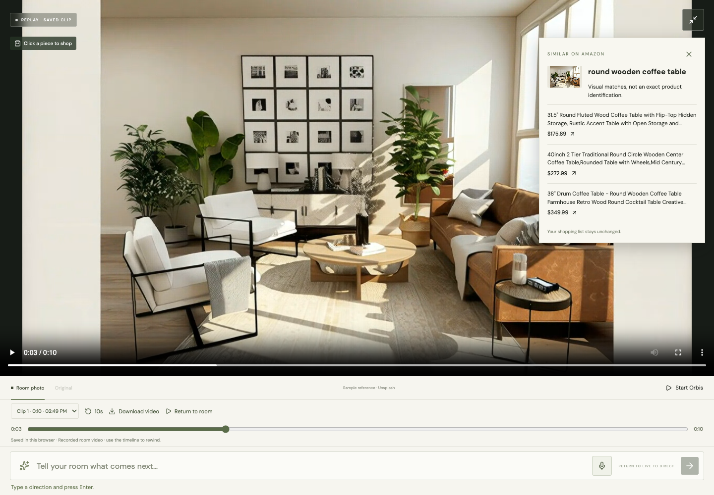
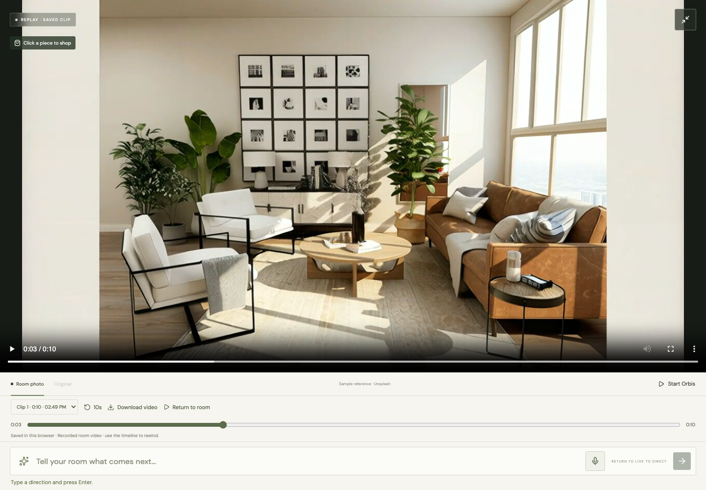

# Clickable video and saved replay

Verified September 12, 2026. The current backend suite passes **37 tests**. The production TypeScript/Vite build and existing fullscreen/voice controls also pass.

## Actual provider journey

The [live receipt](video-shopping-live.json) records one actual Orbis session, automatic browser recording, a downloaded 1280 × 720 VP8 WebM clip lasting 10.071699 seconds, and a successful seek to three seconds. The stream was ended before shopping the saved frame. OpenAI vision identified the clicked **round wooden coffee table**. Exa returned six Amazon product pages, and Neo4j ranked them. Three source prices were quoted ($175.89, $272.99 and $349.99); missing prices remained unknown. The overlay displays three candidates. No external document was written and no browser errors occurred.

The downloaded clip was independently decoded by FFmpeg: all 240 frames and the full 10.07-second duration were read. FFmpeg emitted a WebM container-size warning from browser recording metadata; playback and seeking passed in Chromium. The original downloaded verification file is kept only in ignored local runtime storage, while public screenshots and the sanitized receipt document its actual behavior.





## Browser and contract checks

[Browser results](video-shopping-browser.json) use a clearly labeled synthetic video and mocked remote providers, with **real browser MediaRecorder, downloaded WebM and IndexedDB**. They cover recording from decoded frames, finite duration, timeline seeking, ten-second rewind, download, persistence after reload, replay-frame selection, Amazon links, visual-provider failure/retry, mobile fullscreen and coordinate mapping for cropped/letterboxed media. Clicking outside the letterboxed image makes no request. The existing player control suite additionally verifies fullscreen drafting, pause/resume recovery and voice input.

Backend tests validate image decoding and limits, point coordinates, the strict OpenAI image/JSON contract, rejection of ambiguous selections, budget and keep rules, unchanged shopping state, and changed-brief rejection while search is running.

```sh
.venv/bin/python -m pytest backend -q
npm run build --prefix frontend
node scripts/test-player-controls.cjs
node scripts/test-video-shopping.cjs
```

The separate `node scripts/test-live-video-shopping.cjs --live` command explicitly calls real Orbis, OpenAI and Exa, downloads a short recording, ends the session and inspects the saved frame.

## Behavior and boundaries

A click captures the actual displayed live, held, original or replay frame. OpenAI describes the furnishing at that point; Exa finds visually similar Amazon alternatives. A generated object does not establish an exact purchasable SKU. Selection does not mutate the shopping list or authorize a purchase or document write. The image is transient in the backend and the Responses request uses `store:false`.

Recordings start automatically for new live sessions and contain only room video, without microphone audio or interface overlays. Clips persist in IndexedDB on the same browser/origin after saving or ending the stream. Save before closing the tab; downloads are independent files. Each clip stops at ten minutes or approximately 120 MB. Browser quota errors keep the clip available to download. Playback can be rewound while the separate Orbis session remains active; the interface shows that state. Browser/codec support controls whether downloaded clips are WebM or MP4; background tabs can reduce captured frame rate.

Implementation references: [OpenAI image inputs](https://developers.openai.com/api/docs/guides/images-vision), [structured output](https://developers.openai.com/api/docs/guides/structured-outputs), [MediaRecorder](https://developer.mozilla.org/en-US/docs/Web/API/MediaRecorder), and [WebM duration metadata helper](https://github.com/yusitnikov/fix-webm-duration).
