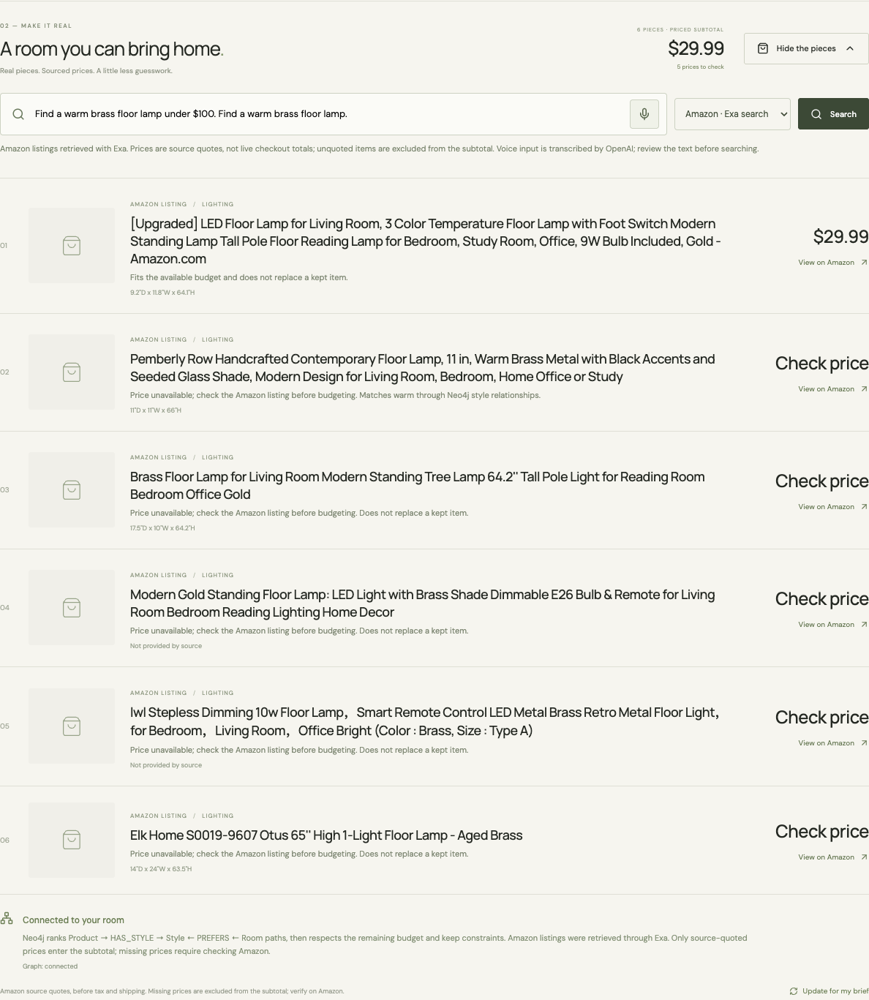

# Fullscreen, Amazon search and voice verification

Verified September 12, 2026 against the local SHOWROOM application. Credentials were read only from the ignored server environment. The original approved Ambiguous document was not modified during this follow-up.

| Behavior | Evidence |
| --- | --- |
| Fullscreen keeps the direction input, microphone and session controls together | Desktop native fullscreen and mobile fallback checks in `scripts/test-player-controls.cjs`; draft, focus and keyboard-height recovery passed |
| Pause holds the frame and actually pauses Orbis | [Actual provider receipt](player-live-verification.json): 2560 × 1440 decoded video, `generation_paused`, stable held frame for 2.2 seconds, acknowledged direction while paused, `generation_resumed`, then a new decoded frame; session ended |
| Exa retrieves genuine Amazon product URLs | [Actual HTTP result](exa-live-verification.json): three side tables, one quoted price of $84.99 and two unknown prices; Neo4j connected |
| OpenAI transcribes audio | [Actual transcription](voice-live-verification.json): locally synthesized test speech became “Find a warm brass floor lamp under $100.” using `gpt-4o-mini-transcribe` |
| Voice search reaches real products in the browser | [Actual browser receipt](voice-search-live-verification.json): Chromium recorded the supplied test WAV as WebM, OpenAI transcribed it, Exa returned six Amazon lamps, and Neo4j ranked them. One quoted price was $29.99; five require checking. No browser errors |
| Recovery and constraints | 33 backend tests passed, including URL/price grounding, missing access, source failures, unknown-price exports, budget limits and existing save recovery. Browser checks passed for pause/resume failures, microphone denial, cancel, fullscreen typing and mobile layout |
| Production build and existing journey | TypeScript/Vite production build passed. [Browser smoke](browser-verification.json) exercised actual local HTTP, image upload, constraint persistence, catalog retrieval and Neo4j on desktop/mobile |

Voice verification used clearly identified synthesized test audio through Chromium's microphone test input; it is not presented as a human speaking into a physical microphone. The control suite uses mocked providers and synthetic video; live integration claims above rely on separate actual API receipts. Normal use requests the user's microphone permission, records at most 45 seconds, and requires reviewing and submitting the transcript. Audio remains transient in the application and is sent to OpenAI for transcription.

Exa source text does not always contain a current item price or usable product photograph. Unknown prices remain unknown; they are not counted as zero-cost purchases. Amazon telemetry URLs returned as page images are rejected; unavailable photographs use an icon. Item titles, links, quoted dimensions and source-backed prices are shown without inventing substitutes. Search results are candidates, and the priced subtotal excludes tax, shipping and all unknown prices.

The opt-in `scripts/test-live-player.cjs --live` script opens and ends an actual Orbis session. `scripts/test-live-voice-search.cjs --live /path/to/test.wav` makes real OpenAI and Exa calls. These are separate from the default offline provider-contract checks.

Implementation contracts: [Exa search API](https://exa.ai/docs/reference/search-api-guide-for-coding-agents) and [OpenAI speech-to-text](https://developers.openai.com/api/docs/guides/speech-to-text).
