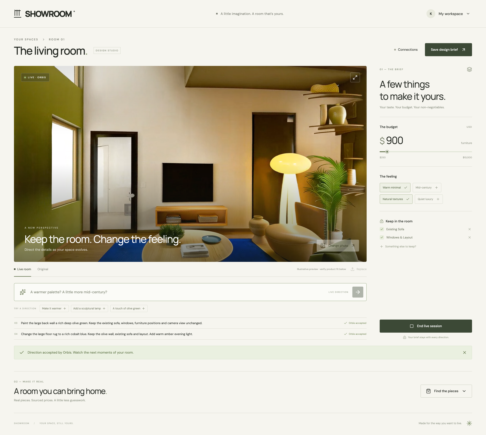
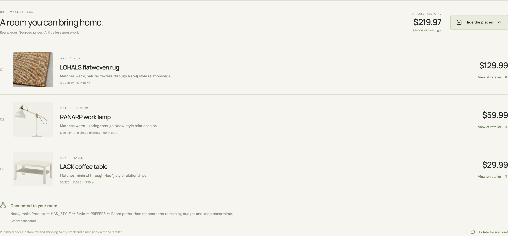
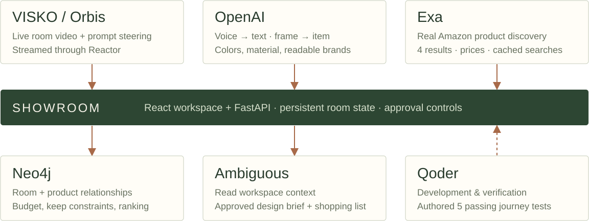

# SHOWROOM / Live rooms

**Hosted studio:** [showroom-q4s4.onrender.com](https://showroom-q4s4.onrender.com) · open without sign-in. See the [Render deployment guide](../../docs/deploy-render.md).

**A room you can direct while you think.**

Upload a living room, preserve what matters and use short instructions to direct a live Orbis session. SHOWROOM keeps the budget and product decisions beside the visual preview so the conversation can lead to a practical room plan.

The browser integration uses Reactor’s streaming SDK with access scoped by the Python backend. Connection startup, prompt acknowledgments, capacity errors and disconnects have visible states. A real Orbis session was captured with advancing decoded frames and two visibly different directions: a deep olive wall, then a cobalt rug with warm lighting. Geometry and furnishings can drift; the video is illustrative. The verification record contains the evidence.

## Direct and discover by voice

Maximize the room and keep typing or dictating directions. Pause holds the visible frame and pauses Orbis generation; Resume continues it. Furniture search now retrieves real Amazon product pages through Exa, with OpenAI speech-to-text beside both inputs. Review the transcript before sending. Missing source prices display “Check price” and are excluded from the priced subtotal. [Actual provider and browser evidence](../../docs/evidence/voice-and-player.md).

Click furniture directly in a live, paused or saved frame to inspect visually similar Amazon matches. New live sessions record locally; **Save & rewind** opens a seekable replay, and **Download video** keeps a separate file. Clips persist in this browser. [Frame shopping and recording evidence](../../docs/evidence/video-shopping.md).

Search requests four Amazon results, reuses cached content and includes visible brand markings, colors and item types in matching. [Measured cache latency](../../docs/evidence/search-latency-live.json). [Render hosting setup](../../docs/deploy-render.md).

## Run and inspect

See [QUICKSTART](../../README.md) for Python/FastAPI, React and local Neo4j startup. Frontend: **http://localhost:5190**. Backend: **http://localhost:8190**. Credentials remain server-side in ignored `.env`.

- [Current verification and integration status](../../docs/evidence/verification.md)
- [Five-page PDF deck](../../artifacts/showroom-deck.pdf) and [editable deck](../../docs/deck/showroom-deck.html)
- [Two-minute MP4](../../artifacts/video/showroom-demo.mp4), [captions](../../artifacts/video/showroom-demo.srt) and [poster](../../artifacts/video/poster.jpg)
- [Qoder engineering evidence](../../docs/evidence/qoder.md)
- [Event eligibility and source disclosure](../../docs/evidence/event-eligibility.md)

## Shared-code disclosure

This is **one SHOWROOM codebase** with a presentation-specific README. The live-video, Ambiguous-coworker and Qoder/Neo4j repository packages contain the same backend and frontend source, recorded by SHA-256 in `publication.json`. They are not three independent projects. The participant confirmed cross-event eligibility on September 12, 2026. No event entry, award or hosted application deployment is implied by this repository.

[Canonical live-video repository](https://github.com/KaushikSiva/showroom) · [Ambiguous coworker presentation](https://github.com/KaushikSiva/showroom-coworker) · [Qoder / Neo4j presentation](https://github.com/KaushikSiva/showroom-graph).

Generated video is an illustrative preview; product source links, dimensions, reference images and catalog prices substantiate buying decisions. No hardware benchmark, award win or customer traction is claimed.
